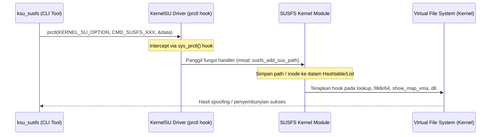

# Panduan Lengkap Backport SUSFS ke Kernel 4.19 (Legacy/Universal)

Dokumentasi ini menjelaskan arsitektur, cara kerja, instalasi, troubleshooting, dan cara penggunaan repositori backport SUSFS v2.2.0+ untuk kernel versi lama **4.19 NON-GKI (Universal)**.

---

## 1. Pendahuluan & Latar Belakang

### Apa itu SUSFS?
**SUSFS (SUS Filesystem)** adalah modul kernel yang bekerja berdampingan dengan **KernelSU (KSU)**. SUSFS berfungsi untuk menyembunyikan tanda-tanda modifikasi sistem (seperti status root, mount point, mapping memory, dan path tertentu) dari deteksi aplikasi (misalnya Google Play Integrity, perbankan, game, dll.).

### Mengapa Backport ini Diperlukan?
Upstream resmi dari SUSFS (`simonpunk/susfs4ksu`) terbagi menjadi:
1. **Branch `kernel-4.19`**: Masih menggunakan SUSFS versi lama (v1.5.5) yang kekurangan fitur deteksi modern.
2. **Branch `main`**: Mendukung SUSFS versi terbaru (v2.2.0+), namun kodenya ditargetkan untuk kernel modern (5.x/6.x GKI).

Proyek **backport-susf4ksu-legacy** ini menjembatani celah tersebut dengan membawa fitur-fitur **v2.2.0+** (seperti `SUS_MAP` untuk menyembunyikan mmap library, `avc_log_spoofing` untuk spoofing SELinux, dan `sus_su`) ke kernel lawas **4.19 NON-GKI**.

---

## 2. Arsitektur Interaksi System

Berikut adalah diagram bagaimana userspace CLI berkomunikasi dengan driver kernel untuk menerapkan manipulasi/penyembunyian:



---

## 3. Fitur Utama v2.2.0+ yang Di-backport

| Fitur | Kode Kconfig | Mekanisme Penyembunyian |
| :--- | :--- | :--- |
| **SUS_PATH** | `CONFIG_KSU_SUSFS_SUS_PATH` | Menyembunyikan path/file dari syscall `d_lookup`, `filldir64` (aplikasi melihat file seolah tidak ada). |
| **SUS_MOUNT** | `CONFIG_KSU_SUSFS_SUS_MOUNT` | Menghapus entry mount point dari `/proc/self/mounts` agar mount KSU tidak terdeteksi. |
| **SUS_MAP** (v2.2.0) | `CONFIG_KSU_SUSFS_SUS_MAP` | Menyembunyikan memory mapping (`mmap`) library su/root dari file `/proc/self/maps` & `smaps`. |
| **AVC_SPOOF** (v2.2.0) | *(Built-in SELinux)* | Melakukan spoofing log audit AVC SELinux dari context `su` menjadi `u:r:priv_app:s0`. |
| **SUS_SU** | `CONFIG_KSU_SUSFS_SUS_SU` | Menyediakan non-kprobe root shell yang memotong mekanisme deteksi standar. |
| **OPEN_REDIRECT** | `CONFIG_KSU_SUSFS_OPEN_REDIRECT` | Mengalihkan pembacaan file tertentu secara transparan ke file dummy yang aman. |

---

## 4. Panduan Instalasi (Patching)

Proyek ini dirancang sebagai **dependency project**. Kamu harus menerapkan patch ini ke source kernel target kamu.

### Cara Otomatis (Direkomendasikan)
Jalankan script auto-apply untuk menerapkan semua patch dan fixup secara berurutan:
```bash
bash core-scripts/apply.sh /path/ke/kernel/source [--mtk] [--xiaomi-vermagic]
```
*Script ini bersifat **idempotent**. Jika `fs/susfs.c` sudah terdeteksi di kernel target, proses apply patch utama akan dilewati untuk mencegah konflik.*

---

### Cara Manual (Langkah demi Langkah)

Jika kamu ingin melakukan patching secara manual, ikuti langkah-langkah di bawah ini secara berurutan:

#### Langkah 1: Terapkan Patch Utama SUSFS 4.19
Gunakan tool `patch` di root kernel source target:
```bash
cd /path/ke/kernel/source
patch -p1 --fuzz=5 < /path/ke/backport-repo/kernel/50_add_susfs_in_kernel-4.19.patch
```
*Jika ada hunk yang gagal (`.rej` file), gunakan `wiggle` untuk fallback:*
```bash
find . -name "*.rej" -exec wiggle --replace {} +
```

#### Langkah 2: Terapkan Patch Integrasi KernelSU
Masuk ke direktori `drivers/kernelsu` di kernel target, lalu apply patch:
```bash
cd drivers/kernelsu
patch -p1 --fuzz=3 < /path/ke/backport-repo/kernel/KernelSU/10_enable_susfs_for_ksu.patch
cd ../..
```

#### Langkah 3: Terapkan Patch Tambahan v2.2.0
Terapkan patch tambahan untuk fitur `SUS_MAP` dan `AVC_SPOOF` dari root kernel source:
```bash
patch -p1 --fuzz=3 < /path/ke/backport-repo/patches/004-sus_map-proc-maps.patch
patch -p1 --fuzz=3 < /path/ke/backport-repo/patches/005-avc-log-spoofing.patch
```

#### Langkah 4: Jalankan Script Fixup
Jalankan python scripts berikut untuk menyesuaikan kode dengan spesifik vendor (MediaTek KABI, SElinux, dll.):
```bash
python3 /path/ke/backport-repo/fixup/fix_susfs_sched.py .
python3 /path/ke/backport-repo/fixup/fix_susfs_namespace.py .
python3 /path/ke/backport-repo/fixup/fix_supercall_susfs.py drivers/kernelsu/supercall/supercall.c
python3 /path/ke/backport-repo/fixup/fix_susfs_selinux.py .
python3 /path/ke/backport-repo/vendor/mediatek/fix_mtk_includes.py .
```

#### Langkah 5: Sesuaikan Include di KernelSU
Ubah semua include header `susfs_def.h` menjadi `susfs.h` di dalam source KernelSU:
```bash
find drivers/kernelsu -type f -exec sed -i 's|susfs_def\.h|susfs.h|g' {} +
```

---

## 5. Daftar Script Fixup & Penjelasannya

* **`fix_susfs_sched.py`**: Menambahkan deklarasi `struct mtk_kabi_info` ke `susfs.h` jika config `CONFIG_MTK_SCHED_EXTENSION` aktif untuk mencegah error kompilasi pada kernel MediaTek.
* **`fix_susfs_namespace.py`**: Mengintegrasikan hook mount hiding custom `susfs_hide_mount()` ke dalam `fs/namespace.c`.
* **`fix_supercall_susfs.py`**: Menyelesaikan konflik deklarasi tipe fungsi penanganan supercall (`susfs_call_t`) antara KernelSU dan SUSFS.
* **`fix_susfs_selinux.py`**: Menyisipkan hook bypass SELinux `susfs_selinux_bypass()` ke dalam `security/selinux.c`.
* **`fix_mtk_includes.py`**: Memperbaiki header platform MediaTek (`mt6768`) dan driver video agar kompatibel saat dicompile menggunakan **Clang 16+**.
* **`patch_vermagic.py`**: Melakukan bypass pemeriksaan vermagic kernel agar Xiaomi vendor module bawaan stock ROM dapat di-load oleh kernel kustom kita.

---

## 6. Cara Menggunakan CLI Tool (`ksu_susfs`)

Setelah kernel berhasil dicompile dan di-flash, kamu bisa menggunakan CLI tool `ksu_susfs` di Android (melalui root shell/termux) untuk mengontrol fitur SUSFS.

### Perintah CLI yang Sering Digunakan:

* **Melihat Status Fitur & Versi:**
  ```bash
  ksu_susfs show version
  ksu_susfs show enabled_features
  ksu_susfs show variant
  ```

* **Menyembunyikan Path File/Folder:**
  ```bash
  ksu_susfs add_sus_path /data/adb/modules
  ```

* **Menyembunyikan Memory Mapping (SUS_MAP):**
  ```bash
  ksu_susfs add_sus_map /data/adb/ksu/bin/busybox
  ```

* **Mengaktifkan AVC Audit Log Spoofing:**
  ```bash
  ksu_susfs enable_avc_log_spoofing 1
  ```

* **Mengaktifkan Fitur Hide Mounts untuk Proses Non-SU:**
  ```bash
  ksu_susfs hide_sus_mnts_for_non_su_procs 1
  ```

---

## 7. Troubleshooting & Batasan Kritis

> [!IMPORTANT]
> **Hanya untuk Kernel 4.19**
> Patch ini dikhususkan untuk kernel lawas 4.19. Jangan mencoba menerapkannya pada kernel 5.x atau 6.x karena struktur internal kernel (seperti VFS dan task_struct) sudah jauh berbeda dan akan menyebabkan conflict parah.

> [!WARNING]
> **CONFIG_FUSE_PASSTHROUGH Harus Dinonaktifkan**
> Pastikan config `CONFIG_FUSE_PASSTHROUGH=n` pada defconfig kernel kamu. Jika aktif, fitur ini akan memicu deadlock/bootloop saat SUSFS mencoba melakukan manipulasi path.

> [!NOTE]
> **Verifikasi setelah Patching**
> Selalu jalankan script verifikasi setelah menerapkan patch:
> ```bash
> bash core-scripts/verify.sh /path/ke/kernel/source [nama_defconfig]
> ```
> Pastikan nilai **Errors: 0**. Jika ada warning tentang `susfs_def.h still exists`, hal itu wajar karena file tersebut sengaja dipertahankan sebagai backup macro definition.
